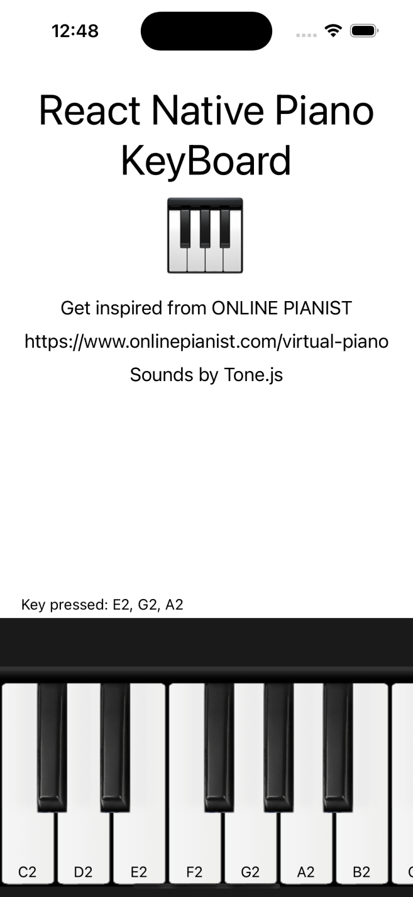
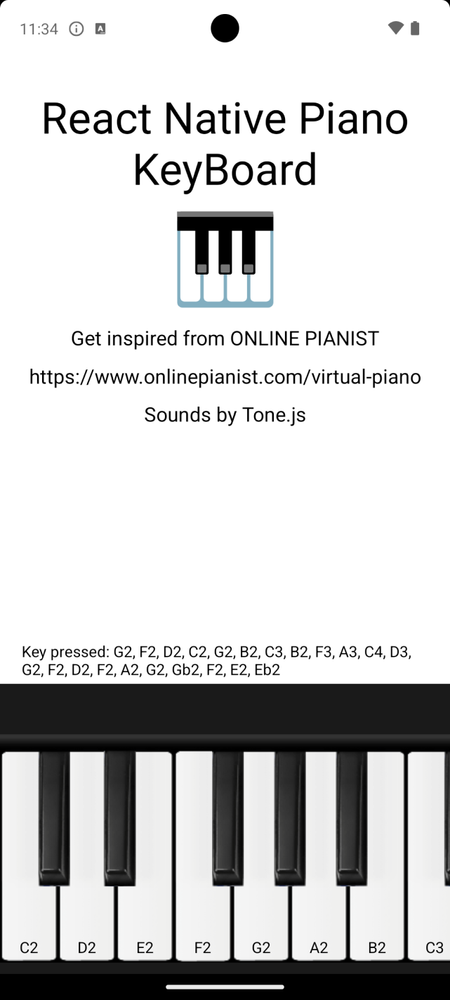
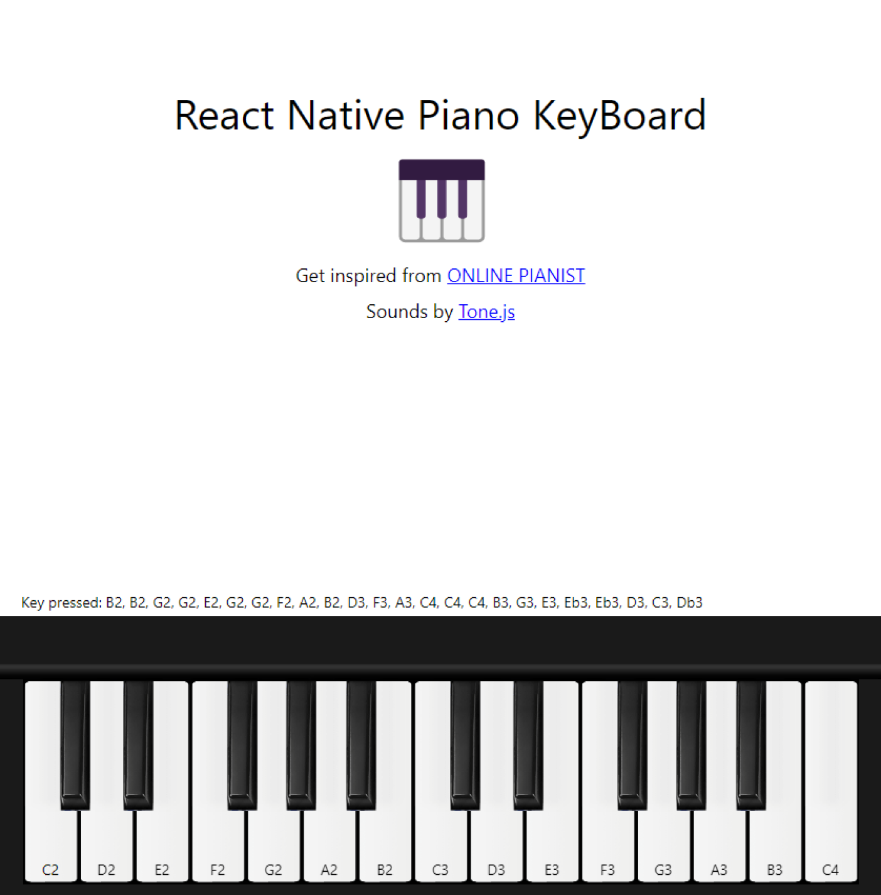

# React Native Piano Keyboard

A beautiful and customizable piano keyboard component for React Native applications.

## Installation

```bash
npm install react-native-piano-keyboard
# or
yarn add react-native-piano-keyboard
```

## Dependencies

This package requires the following peer dependencies:
- react
- react-native
- expo
- expo-av
- expo-image
- tonal
- tone
- react-native-webview

## Usage

```jsx
import React from 'react';
import { PianoKeyboard, MidiProvider } from 'react-native-piano-keyboard';

const App = () => {
  const handleKeyPress = (note: string) => {
    console.log('Pressed note:', note);
  };

  return (
    <MidiProvider>
      <PianoKeyboard
        startKey="C2"
        endKey="C4"
        onPressKey={handleKeyPress}
      />
    </MidiProvider>
  );
};

export default App;
```

## Props

### PianoKeyboard

| Prop | Type | Default | Description |
|------|------|---------|-------------|
| startKey | string | "C2" | The starting note of the keyboard |
| endKey | string | "C4" | The ending note of the keyboard |
| keyDisabled | boolean | false | Whether the keyboard keys are disabled |
| onPressKey | (key: string) => void | required | Callback function when a key is pressed |

## License

MIT

# Welcome to React Native Piano Keyboard 👋
This is an [Expo](https://expo.dev/) project and Inspired from [ONLINE PIANIST](https://www.onlinepianist.com/virtual-piano)

## ScreenShots
| iOS | Android | Web |
| ----------- | ----------- | ----------- |
|  |  |  |

## Get started
1. Install dependencies

   ```bash
   npm install
   ```

2. Start the app

   ```bash
    npm start
   ```

In the output, you'll find options to open the app in a

- [development build](https://docs.expo.dev/develop/development-builds/introduction/)
- [Android emulator](https://docs.expo.dev/workflow/android-studio-emulator/)
- [iOS simulator](https://docs.expo.dev/workflow/ios-simulator/)
- [Expo Go](https://expo.dev/go), a limited sandbox for trying out app development with Expo

[Webview](https://github.com/react-native-webview/react-native-webview) and [Tone.js](https://tonejs.github.io/) are used to implement the piano sound.

## Contributors

- [zhen1007](https://github.com/zhen1007) ([Portfolio](https://zhen-portfolio.vercel.app/))
- [gscripts](https://github.com/grnsmn) ([Portfolio](https://simoneguarnuccio.vercel.app/))

> ⚠️ **Warning:** Version `1.0.0` published on npm is broken due to missing assets. Please use version `1.0.1` or higher.
